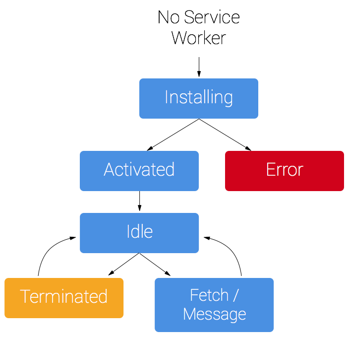

Caching always has proven to be winner when it comes to **performance**.
Browser by defaults caches the resources on its end, but to get these resources it still needs internet. Browser can serve resources from its cache only when a network request is made

Service workers provides the way to bypass the network request. It sits between the network and browser, and can decide where to serve resources from.

The basic lifecycle of service worker is as following:


***
###Setup

**Register Service worker:**  
We need to check if the [browser supports](https://caniuse.com/#feat=serviceworkers) serviceworkers and then register by providing the path to serviceworker file.

<center><sub>In Page</sub></center>

```javascript
if ('serviceWorker' in navigator) {
  navigator.serviceWorker.register('/service-worker.js');
}
```

**Install Service worker:**  
When the serviceworker is installed (initiated by script from website), we need to define teh resources wich we wish to cache, These are cached and linked to specific `Cache` key.  
Ideally we should not cache any third party resource but only which are sered from same domain.
<center><sub>In Service worker</sub></center>

```javascript
self.addEventListener('install', function (event) {
    event.waitUntil(
        caches.open('cache-key').then(function (cache) {
            return cache.addAll(
                [
                    '/css/style.css',
                    '/js/script.js',
                    '/index.html'
                ]
            );
        })
    );
});

```

**Activate Service worker:**  
In this step we can delete all the unused cache and also bump the cache version (using cache-key).
<center><sub>In Service worker</sub></center>

```javascript
self.addEventListener('activate', function(event) {
    event.waitUntil(
        caches.keys().then(function(cacheName) {
            return Promise.all(
                cacheName.filter(function(name) {
                    return name !== 'cache-key';
                }).map(function(name) {
                    return caches.delete(name);
                })
            )
        })
    )
});
```

**Handle network request:**  
Listen to the fetch event and capture the network request, depending on you cache strategy handle and return the response.
<center><sub>In Service worker</sub></center>

```javascript
self.addEventListener('fetch', function (event) {
    event.respondWith(
        caches.match(event.request).then(function (response) {
            if (!response) response = fetch(event.request);
            return response;
        })
    );
});
```

***
###Caching techniques

*  *Cache only* - This serves the files only and only from cache, it will never make a network request. Use this if you dont want to update your resource frequently  

<center><sub>In Service worker</sub></center>

```javascript
self.addEventListener('fetch', function(event) {
    event.respondWith(caches.match(event.request));
});
```

*  *Cache, fallback Network* - This serves the files from cache, if the file fails to load from cache it will make a network request.  

<center><sub>In Service worker</sub></center>

```javascript
    self.addEventListener('fetch', function (event) {
        event.respondWith(
            caches.match(event.request).then(function (response) {
                if (!response) response = fetch(event.request);
                return response;
            })
        );
    });
```
*  *Network, falbback Cache* - This makes first a network request and if network request fails then it fallbacks to cache response, please note the cahce will be returned only when the network request is completed and gives a failed reponse.  

<center><sub>In Service worker</sub></center>

```javascript
    self.addEventListener('fetch', function (event) {
        event.respondWith(
            fetch(event.request).catch(function () {
                return caches.match(event.request);
            })
        );
    });
```
*  *Cache then network* - The response is first served from the cache in the page, and then network request is made. When the response from network request is recieved then again the response is served and the page is updated (or whatever the logic reuires to do). 

<center><sub>In Page</sub></center>

```javascript
caches.match('/data.json')
    .then(response => {
        updatePage(response);
        fetch('/data.json').
            then(result => {
                updatePage(result);
            })
    })
    .catch(() => {
        fetch('/data.json').
            then(response => {
                updatePage(response);
            })
    });
```
<center><sub>In Service worker</sub></center>

```javascript
self.addEventListener('fetch', function (event) {
    event.respondWith(
        caches.open('cache-key').then(function (cache) {
            return fetch(event.request).then(function (response) {
                cache.put(event.request, response.clone());
                return response;
            });
        })
    );
});
```

*  *Serving custom response* - This can be best way to notify user for an offline connection or some other custom pages.  

<center><sub>In Service worker</sub></center>

```javascript
    self.addEventListener('fetch', function (event) {
        event.respondWith(
            // Try the cache
            caches.match(event.request).then(function (response) {
                if (response) {
                    return response;
                }
                return fetch(event.request).then(function (response) {
                    if (response.status === 404) {
                        return caches.match('/404.html');
                    }
                    return response
                });
            }).catch(function () {
                return caches.match('/offline.html');
            })
        );
    });
```

***
While most of the times serviceworkers are constrained tp prgressive web apps, but these are also used to make websites more performant and better user experience.  
